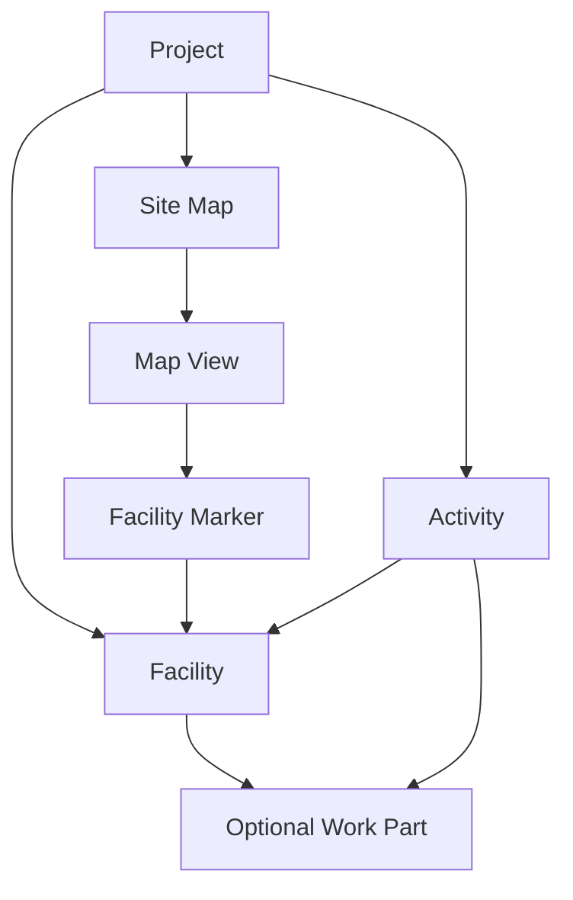

# Facility, Maps and Activities architecture audit

Date: 2026-10-01. This report describes inspected source and the local database, not an implemented target architecture.

The user-provided target is Project → Map → View → Facility Marker → Facility → optional Work Part → Activity. The latest seed instruction takes precedence: `db:seed` creates only the existing development user. Do not recreate the STS project, contractors, 15 facilities, markers or demo activities automatically.

## 1. Current architecture

The application is a Bun workspace with React/Vite/MUI/TanStack Query/RHF/Zod/Konva in `apps/web`, and Elysia/Drizzle/PostgreSQL/MinIO in `apps/api`. Modules separate routes, schemas, services and repositories. The contractor module is the existing CRUD reference.

`site_plans` already provides a project-owned collection of maps: ID, project, name, default flag and timestamps. Its single background object key and dimensions represent one image. `site_marker_definitions` is a map-owned display catalog keyed by `(site_plan_id, key)` with a nullable Zone link and four Overview/Top coordinates. It is not an independent Facility entity.

`zone_parts` belongs to `zones`. `site_activities.zone_id` is mandatory and `zone_part_id` is optional. The normal activity repository uses an inner join to Zones; therefore a location without a Zone cannot have an activity. The main UI holds `selectedZoneId`, `selectedPartId` and a WBS group focus. Overview/Top are fixed frontend modes and image paths. The experimental R3F module is isolated from the primary image map.

Local database evidence after the authorized cleanup: 1 user (`contractor@sts.local`); 0 rows in all 12 other application tables; 11 applied migrations. Historical migration files remain. The database backup created before the wipe is outside the repository. There is no local production data to backfill, but migrations must still preserve populated external environments.

Baseline: `bun test` passed 39 tests, and `bun run typecheck` passed all workspaces. This baseline is not evidence of the target architecture being implemented.

## 2. Zone dependencies

| Boundary         | Inspected dependencies                                                                                    | Required transition                                                                                          |
| ---------------- | --------------------------------------------------------------------------------------------------------- | ------------------------------------------------------------------------------------------------------------ |
| Storage          | `zone.schema.ts`, `zone-part.schema.ts`, `site-activity.schema.ts`, `site-plan.schema.ts`                 | Retain Zone/WBS and historical geometry; introduce independent Facility ownership.                           |
| Activity API     | `modules/site-activities/{type,schema,service,repository,route}.ts`                                       | Mandatory Zone input, Zone/Part validation, Zone inner join and Zone filters must gain Facility equivalents. |
| Work Parts       | `modules/zone-parts/*`                                                                                    | Leaf-Zone requirement and Zone-owned code uniqueness become Facility ownership for new operations.           |
| Legacy maps      | `modules/site-plans/{service,repository,schema,geometry}.ts`                                              | Existing display definitions and point rows are migration inputs, not the new canonical Facility store.      |
| WBS API          | `modules/zones/*`                                                                                         | Keep for internal reporting and compatibility; do not present in primary Facility flows.                     |
| Web contracts    | `features/site-plan/{types,api,schemas}`                                                                  | Separate Facility IDs from legacy Zone IDs.                                                                  |
| Operational page | `site-plan-view.tsx`, `activity-dialog.tsx`, `zone-inspector.tsx`, `utils/{site-plan-map,zone-status}.ts` | Replace canonical selection, form location, list filtering and inspector copy.                               |
| Configuration    | `pages/site-plan-config-page.tsx`, `features/zone-configuration/*`                                        | Stop requiring linked Zones and Zone color settings for Facility administration.                             |
| Navigation       | `app/layouts/app-layout.tsx`, router                                                                      | Rename Zone Configuration and retain the old URL as a compatibility redirect.                                |
| Experimental 3D  | `site-plan-3d-viewer.tsx`, `facility-3d-assets.ts`                                                        | Keep isolated; it does not define the new operational domain.                                                |

Parts and activities are counted as activity rows once. A Facility summary must not add direct work to Part work if both already use the same activity table.

## 3. Target Facility architecture

Facility is project-owned and can exist without any marker. A marker is one normalized position for a Facility on one View. Its identity is the Facility ID, not a label, filename or Zone ID. Map/View changes preserve `selectedFacilityId` and `selectedFacilityPartId`. An unlinked legacy location such as TR is a valid Facility and can receive Parts and Activities directly.

## 4. Required schema changes

| Storage                | Change                                                                                                                                                                                                                                                     |
| ---------------------- | ---------------------------------------------------------------------------------------------------------------------------------------------------------------------------------------------------------------------------------------------------------- |
| `site_plans`           | Reuse this equivalent Map container; add `description` and `is_active`. Expose it as Site Map in API/UI. Retain IDs and background metadata for compatibility. Avoid a duplicate `site_maps` store.                                                        |
| `facilities`           | Add project ID, immutable project-unique key, name, optional code, order, active flag, timestamps and nullable internal `legacy_zone_id`. No Map ownership.                                                                                                |
| `site_map_views`       | Add Map ID, Map-unique key, name, image object key or legacy asset URL, width/height, order, active flag and timestamps. No fixed two-View enum.                                                                                                           |
| `facility_map_markers` | Add Facility ID, View ID, normalized non-null x/y, timestamps and unique `(facility_id, site_map_view_id)`. Removing a marker deletes only this visual placement.                                                                                          |
| `zone_parts`           | Reuse existing Part records/IDs. Add `facility_id`; allow `zone_id` to be null for new Parts. The API names them Facility Parts. Retain old coordinates/color and Zone linkage internally during migration. Add Facility/code uniqueness.                  |
| `site_activities`      | Add nullable `facility_id` and `facility_part_id`, initially nullable for unresolved legacy rows. Allow `zone_id` to be null for Facility-native work. Preserve old columns and all operational fields. Require a valid Facility for new canonical writes. |
| `users`                | No current role system exists. Introduce one explicit Site Configuration capability with default deny, surfaced through the current auth context. Granting the surviving user that capability awaits the user's account choice.                            |

Database checks enforce normalized coordinates, valid active/order fields and unique marker/View and Facility/Part keys. Services verify that Facility and Map View belong to the same Project and that a selected Part belongs to the Facility. Archive business entities instead of cascading away activity history.

## 5. Migration and backfill plan

1. Apply additive schema changes. Do not drop Zones, historical area/point rows, old display definitions, Parts or Activities.
2. Resolve existing display definitions into Facilities by Project + stable key, deduplicating the same Facility across Maps. Carry an existing valid physical Zone link internally. TR creates a Facility even with a null Zone link.
3. For physical Zones with historical Parts/Activities but no catalog entry, create one legacy-derived Facility from the persisted business record. Do not create Facilities for logical parent WBS groups merely to satisfy a foreign key.
4. Associate existing Part IDs with the resolved Facility. Backfill Activity Facility and Part references without duplicating activity rows. Ambiguous parent-Zone activity remains intact in compatibility storage and is reported for deliberate resolution; do not guess from its title.
5. Create Views from actual persisted map backgrounds and configured projections. Known STS public assets can be retained as migrated asset references; an unrelated Project must not inherit the STS Overview image.
6. Copy explicit per-View anchors first. If a Facility has no explicit point and only a historical Top polygon, use a visual bounds center for Top only. Preserve explicit removal and never derive Overview from Top coordinates. Keep original rows.
7. Compare IDs, row counts, activity ownership and coordinates in a separate migration test database. Rerun backfill to prove idempotence. List unresolved rows and conflicts.
8. Move UI and canonical writes to Facility. Legacy API adapters may resolve unambiguous Zone relationships internally. Enforce stricter canonical non-null storage only after every persisted legacy row has been resolved.

On the cleaned local database these steps should create no project data. Verification fixtures must run in a separate test database and must not become development seed data.

## 6. API changes

| Resource      | API behavior                                                                                                                                                                                                                                        |
| ------------- | --------------------------------------------------------------------------------------------------------------------------------------------------------------------------------------------------------------------------------------------------- |
| Facilities    | Project list/create; ID read/update/archive. Code/key uniqueness is scoped to Project. Exclude internal legacy linkage from normal input/UI.                                                                                                        |
| Maps          | Project list/create; ID read/update/archive and default selection. Reuse the existing map rows.                                                                                                                                                     |
| Views         | Map list/create; ID update/archive; image upload through authenticated admin endpoint and existing MinIO storage.                                                                                                                                   |
| Markers       | View list and transactional draft save; upsert by Facility/View; remove placement without deleting Facility. Reject foreign-project relationships.                                                                                                  |
| Parts         | Facility list/create; ID update/archive. No Zone selection and no mandatory coordinates.                                                                                                                                                            |
| Activities    | Extend canonical create/update/read/list with Facility and optional Part validation. Support server filters for date, Facility, Part, contractor and status. Keep compatibility reads/writes for legacy IDs until migration is verified.            |
| Summaries     | Server aggregation grouped by Facility for the selected date/contractor/status. Return activity count, distinct contractor count, manpower total and highest-priority status. Do not ship all project activity rows to compute an inspector filter. |
| Project setup | Existing API only lists Projects; the Projects page is a hardcoded placeholder. Add the minimum real Project creation/update and contractor assignment needed to operate from the cleaned database.                                                 |

Existing HTTP client always sends JSON Content-Type. Multipart upload must let the browser set its own FormData boundary. Read URLs are minted only after authentication. Existing storage supports upload/remove/presigned read; no new object-storage service is needed.

## 7. Site Configuration changes

Use Maps and Facilities as primary sections. Maps select a Map, then dynamic View, then an existing Facility. Click to place, drag to adjust, Save/Cancel drafts; no coordinate values or WBS links in normal UI. Add Map, Add View/upload, Add Facility and Use Existing Facility are independent operations. A reused Facility retains the same ID.

Facility detail exposes separate Markers and Work Parts tabs. Markers list placement across Maps/Views. Work Parts edit names, codes and activation without a Zone selector. Keep unsaved-change guards on route, Project and Map changes. Rename navigation to Site Configuration; preserve old `/site-plan/config` links through a redirect.

## 8. Site Activity changes

Load active Maps and their active Views from the API. Prefer the Overview View when one exists, otherwise the first ordered View. Use the actual View image/dimensions and shared Konva viewport. Preserve Facility selection/date/contractor/status/inspector when switching Maps or Views; an absent marker does not remove the selected Facility.

Filters are Work Date, Facility, Contractor, Status. Remove primary WBS grouping. Server summaries drive marker status/count. Idle markers recede, selected/hovered labels are clear and mobile tap targets stay large. No selection means the map uses the full workspace. Selection shows one Facility inspector on desktop and a bottom sheet on mobile.

The inspector loads Facility-filtered activities from the server and uses canonical Activity terminology. Existing activity items have no separate detail route/UI today: add one shared Activity detail experience, rather than a map-specific duplicate. Add Activity prefills the selected Facility and optional Part while allowing changes.

## 9. Work Parts changes

New ownership is directly Facility → Part. Reuse the existing Part table/IDs and activation behavior. Do not force a Part marker or force Part selection for a Facility-wide Activity. Keep old optional spatial columns internally; their presence does not mean every Part appears on the primary map. New Parts for TR require no Zone.

## 10. Activity changes

New writes require an active Facility in the current Project and an assigned contractor. If supplied, a Part must exist, be active and belong to the Facility. Null Part means whole-Facility work. Updating a Facility must clear or revalidate the Part; stale cross-Facility selections are rejected. Date/contractor/status/Facility/Part filters happen in SQL. Order items by blocked → attention → active → completed, then time/order. Operational fields are retained.

## 11. Permission issues

`requireAuth` verifies only session/user. `AuthUser` has no roles or capabilities. `useCanConfigureSitePlan()` currently returns true for any successful `/me` response. Legacy point/area and Part PUT endpoints consequently allow any authenticated user to configure the site. The command palette's `roles` field is explicitly a future placeholder, not an authorization system.

Add a narrow Site Configuration capability to the existing auth context, default false. Enforce it server-side on configuration CRUD/upload/marker/Part writes, including legacy write endpoints, and mirror it in UI access. Do not infer admin from email text or absence of contractor memberships. Preserve the session/provider boundary. The user's choice of an admin account is pending.

## 12. Compatibility risks

- Physical and logical Zones must not be conflated during backfill. Parent-level Activities need an explicit resolution if mapping is ambiguous.
- Same Facility across multiple Maps must not create duplicate Facilities; markers remain per View.
- Part and Activity IDs/history must survive association changes. Activity summaries count each row once.
- Default/active Map changes and stale selected IDs must be handled during Project switching.
- A Facility may have no marker or an inactive View while its history remains valid and accessible.
- Old clients may send Zone fields; compatibility adapters must reject conflicting Facility/Zone or Part assignments instead of silently changing identity.
- Image upload failures must keep existing images/data usable; presigned read URLs expire and must refresh.
- Current non-site operational pages are mocks/placeholders. Route/smoke verification can prove they remain accessible, not production integration they do not yet have.
- Old 3D roots/WBS mappings are experimental and cannot become the new canonical Facility identity.

## 13. Implementation phases

1. Audit and review this report and the implementation plan; decide the explicit admin account.
2. Add independent Facility/View/Marker schema and non-destructive association/backfill with fixture verification. Keep the app's legacy API usable.
3. Add configuration permissions and resource APIs, plus minimal Project setup so an empty installation is operable.
4. Implement one ACC flow using the generic Facility APIs: create Map + Overview/Top images, create ACC, place both markers, add a Part, add/filter an Activity, click/select/prefill in Site Activity.
5. Reuse the same generic implementation for arbitrary Facilities, Maps and Views; prove TR works without a Zone and ACC can appear on another Map without duplication.
6. Complete Site Configuration CRUD/upload/Parts and dynamic Site Activity with responsive inspector and detail flow.
7. Verify CRUD, persistence, ownership, permissions, summaries, server filters, migration compatibility, desktop/mobile behavior, tests/typecheck/lint/build and unrelated routes.
8. Remove only confirmed dead frontend spatial dependencies. Retain Zone/WBS tables and migration evidence until external production compatibility has been validated.

Implementation progress: [facility-multi-map checklist](facility-multi-map-implementation.md). The user's subsequent instruction explicitly authorizes implementation without stopping for another plan review.
